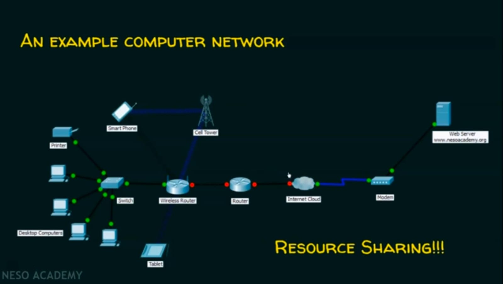
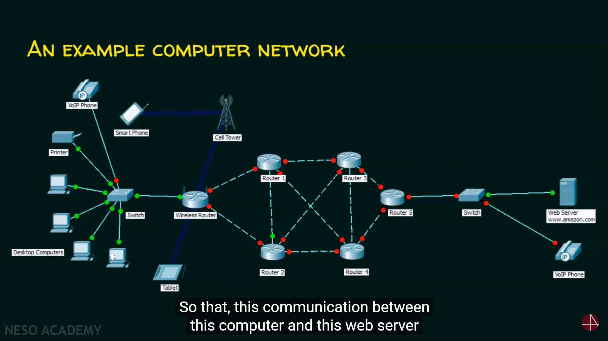

## Introduction to Computer Networks

### Definition:

A computer network is a set of nodes connected by communication links.

A node can be a computer, printer or any other device capable of sending/receiving data generated by another nodes in the network.

Eg: computer, server, printer, security cameras, etc...

A communication link can be a wired link or wireless link, it carries the information.

Eg: cable (Wired) , Air (wireless)

## Basic Characteristics of Computer Network

There are 4 basic Characteristics of Computer Networks:

- Fault Tolerance
- Scalability
- Quality of Service (QoS)
- Security

Eg:

### Fault Tolearance:

the ability to:
    
1. Continue working despite failures
2. Ensure no loss of service

### Scalability:

the ability to:

1. Grow based on the needs
2. Have good performance after growth
   
### Quality of Service (QoS)

the ability to:

1. Set Priorities
2. Manage data traffic to reduce data loss, delay etc., 

### Security

the ability to prevent:

1. Unauthorized access
2. Misuse
3. Forgery

the ability to provide:

1. Confidentiality
2. Integrity
3. Availability

