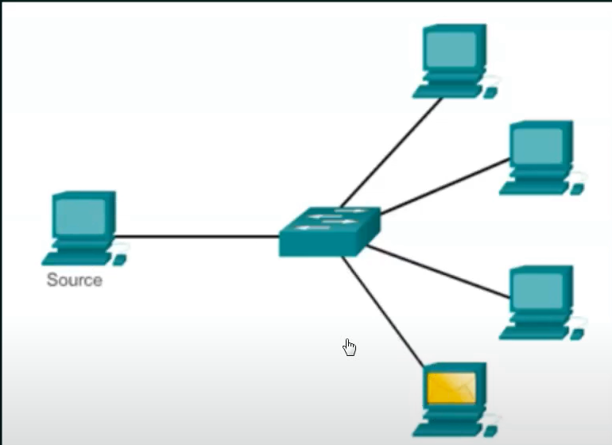
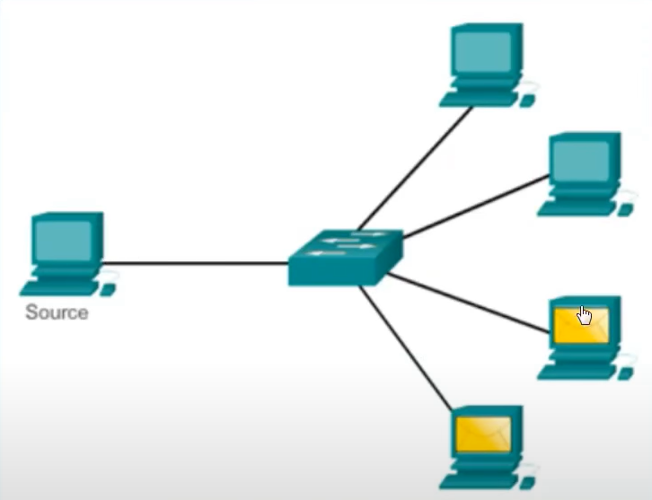
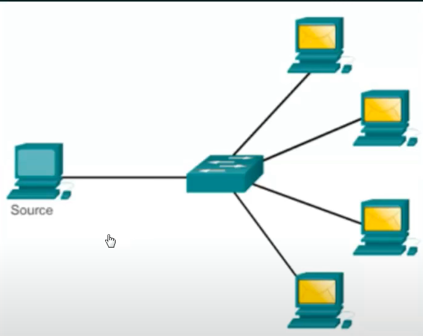

## Data Communication

Data communications are teh exchange of data between two nodes via some form of link (transmission medium) such as a cable

## Data Flow

Data flow means the data is going flow from one to another node. There are three types:

1. Simplex
2. Half Duplex
3. Full Duplex

### Simplex:

- Communication is always unidirectional
- One device can transmit and other devices will recieve

Eg: keyboard, monitor

### Half Duplex:

- Communicaton is in both directions but not at the same time.
- If one device is sending, other can only recieve, and vice versa

eg: Walkie Talkies.

### Full Duplex or Duplex:

- Communication is in both directions simultaneosly
- Device can send and recieve at the same time

Eg: Telephone line

## Protocols

All communication schemes will have the following things in common:

* Source or Sender
* Destination or Reciever
* Channel or Media
  
Rules or Protocols govern all methods of communication

Protocol = Rule

It is a set of rules that govern data communication

Protocol determines:
- What is communicated?
- How it is communicated?
- When it is communicated?
  
**Need of Protocols in Network Communication:**

Protocols used in network communication also define:

*ELEMENTS OF PROTOCOLS:*

- Message Encoding
- Message Formatting and encapsulation
- Message timing
- Message size
- Message delivery options

### 1. Message Encoding:

### 2. Message Formatting and Encapsulation:

- Agreed format
- Encapsulate the information to identify the sender and the receiver rightly.

### 3. Message Size:

- Long messages must also be broken into smaller pieces to travel across a network

### 4. Message Timing

- Flow Control
- Response Timeout
  
### 5. Message Delivery Options:

- **Unicast**: One sender and one reciever
  
- **MultiCast:** If the sender sends the data to set of recievers, but not to all.
  
- **BroadCast:** Sending data to all.
  